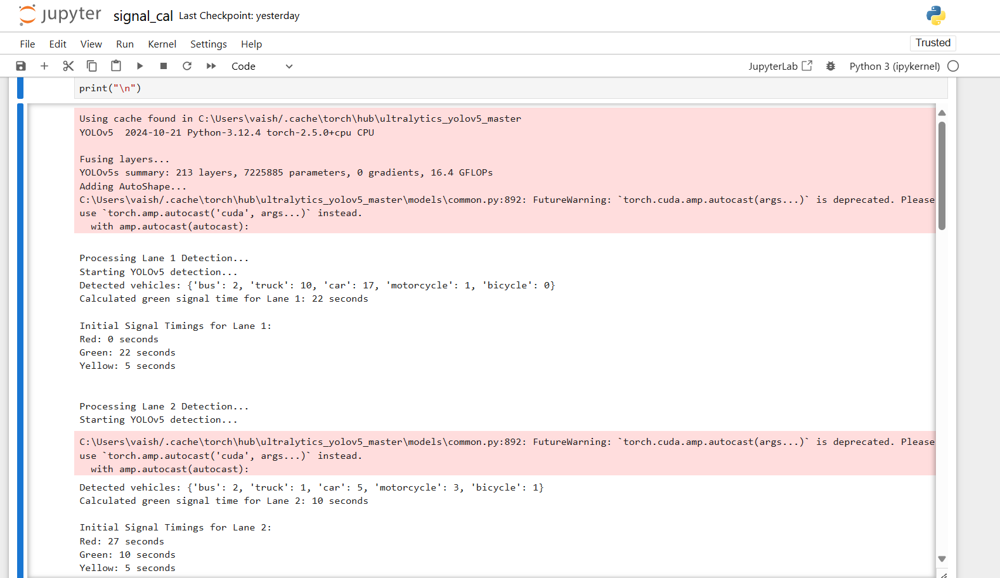
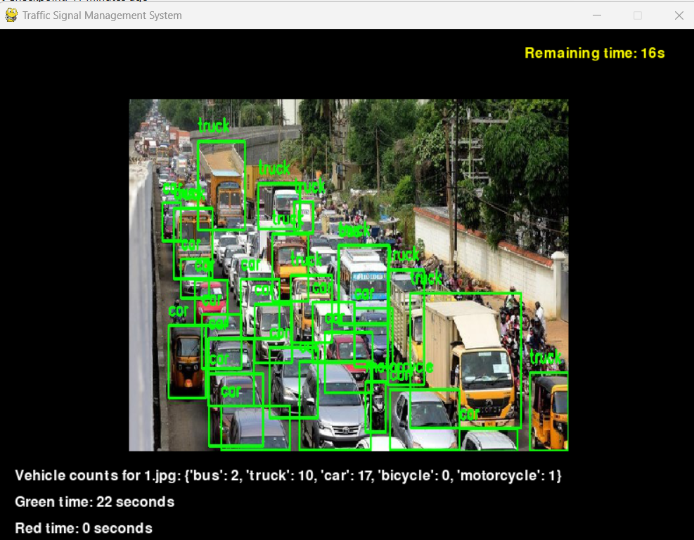

# SmartTraffic-TCMS
Smart Traffic Congestion Management System (TCMS) is an AI-powered system that dynamically adjusts traffic light timings based on real-time vehicle density using YOLOv5 and adaptive algorithms. It reduces congestion, optimizes traffic flow, and improves urban mobility.
# 🚦 Traffic Congestion Management System (TCMS)

## 📌 Overview
The **Traffic Congestion Management System (TCMS)** is an intelligent traffic light management system that dynamically adjusts signal timings based on real-time vehicle density using YOLOv5 and a signal-switching algorithm.

## 📷 Screenshots
**Vehicle Detection Output:**


**Simulation GUI:**



## 🚀 Features
✅ **Real-time Vehicle Detection:** Uses YOLOv5 to detect and classify vehicles.  
✅ **Dynamic Traffic Signal Control:** Adjusts signal durations based on traffic density.  
✅ **Simulation & Visualization:** GUI-based simulation using Pygame.  
✅ **Efficient Traffic Flow Management:** Reduces congestion by up to 25%.  
✅ **Data Logging:** Stores detection results and signal timings for analysis.  

## 🛠 Tech Stack
- **Python**: Main programming language
- **YOLOv5**: Object detection model for vehicle recognition
- **Pygame**: GUI-based traffic simulation
- **OpenCV**: Image processing
- **NumPy, Pandas**: Data handling and analytics

## 📁 Repository Structure
```
TCMS/ 
│── dataset/ # Traffic images for testing 
│── models/ # Trained YOLOv5 models 
│── scripts/ # Python scripts for detection, signal timing, GUI 
│── results/ # Processed images and output logs 
│── docs/ # Documentation and reports 
│── tests/ # Test cases 
│── requirements.txt # Dependencies 
│── README.md # Project Documentation 
│── LICENSE # License for open-source use 
│── .gitignore # Ignore unnecessary files
```

## 🎯 Installation & Setup
1️⃣ **Clone the Repository**  
```bash
git clone https://github.com/your-username/TCMS.git
cd TCMS
pip install -r requirements.txt
python scripts/detection.py
python scripts/gui.py
```
## 📊 Results & Analysis
- **Wait Time Reduction:** Up to **25% improvement** in high-density conditions.
- **Throughput Increase:** **20% more vehicles** processed compared to traditional systems.
- **Optimized Signal Timing:** Adjusts green light durations dynamically for efficient traffic management.

---

## 📌 Future Enhancements  
🔹 **Multi-intersection Coordination** – Expanding the system to manage multiple intersections.  
🔹 **Integration with IoT Sensors** – Incorporating real-time traffic data from IoT devices.  
🔹 **Real-time Cloud Deployment** – Enabling cloud-based traffic control for scalability.  
🔹 **Emergency Vehicle Prioritization** – Adjusting signals dynamically to prioritize emergency vehicles.  

---

## 📜 License  
This project is licensed under the **MIT License**.  

---

## 👥 Authors  
- **Vaishnavi Paswan**  
- **Vedika Agrawal**  
- **Pushkar Dubey**  
- **Mustakeem Shaikh**  

---

## ⭐ Contributing  
Feel free to **fork** this repository, create a branch, and submit **pull requests**!  
For major changes, please open an **issue** first to discuss your proposal.  

---
